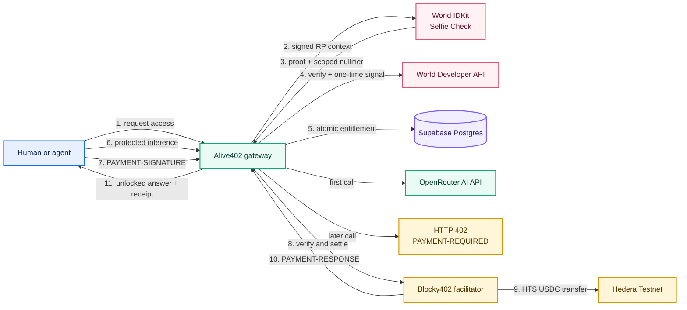

# Alive402

> **One real trial. Then pay per call.**

Alive402 turns a normal AI API trial into a fair, reusable access policy: a person completes World Selfie Check, receives one promotional call, and every later request receives HTTP `402 Payment Required`. A capped autonomous client then pays `0.001` test USDC through x402 on Hedera and retries the exact same request.

The result is a product that an AI API, data provider, or developer-tool company can adopt without changing its upstream handler: fair promotional access for people, programmatic pay-per-call access for agents.

## Live proof

Alive402 has completed a real x402 settlement on Hedera Testnet.

| Evidence | Result |
| --- | --- |
| Payer | `0.0.6499107` |
| Merchant | `0.0.10522345` |
| Asset | Circle test USDC `0.0.429274` |
| Price | `0.001 USDC` |
| Settlement | [`0.0.7162784@1789301497.214020816`](https://hashscan.io/testnet/transaction/0.0.7162784%401789301497.214020816) |
| Protected result | OpenRouter inference unlocked after payment |

## What the judge can do in 60 seconds

1. Open `/demo` and select **Verify for one free call**.
2. Complete a real World Sandbox Selfie Check.
3. Make one free AI request.
4. Send the next request and observe literal HTTP `402` and `PAYMENT-REQUIRED`.
5. Select **Run capped agent · pay 0.001 USDC**.
6. Watch the response unlock, then open the `PAYMENT-RESPONSE` settlement link on HashScan.

The UI is backed by the server and database. It does not hard-code a successful verification, entitlement, 402 response, payment, or transaction hash.

## Why this matters

Email addresses, wallets, and browser cookies are poor free-trial boundaries. Alive402 uses World Selfie Check as a **medium-assurance liveness, continuity, and abuse-resistance signal**. It intentionally does not claim strict global one-person-one-account uniqueness.

Each provider has its own World action. A person can claim a trial from different providers, while a new email, wallet, or browser cannot claim the same provider campaign again. The server verifies the World proof, normalizes the scoped nullifier, and atomically grants and consumes the single promotional call.

## Architecture



The detailed request sequence is in [docs/ARCHITECTURE.md](docs/ARCHITECTURE.md).

## Track mapping

### World — Selfie Check

Alive402 uses `selfieCheckLegacy()` in a functional World IDKit flow. The proof is verified by World’s backend API; a five-minute server-generated signal is stored only as a hash and consumed once, protecting the enrollment flow from proof replay. The app stores no selfie images.

**Track evidence:** working Selfie Check flow, server verification, scoped nullifier deduplication, entitlement replay prevention, and [integration feedback](docs/WORLD_FEEDBACK.md).

### Hedera — AI & Agentic Payments

Alive402 hosts a real x402-gated OpenRouter inference endpoint. It publishes a Hedera Testnet USDC `exact` requirement, accepts canonical `PAYMENT-SIGNATURE`, settles through Blocky402, and returns `PAYMENT-RESPONSE`. A server-side agent has an asset, recipient, amount, per-session, and daily spend cap.

**Track evidence:** real 402, real paid request, Blocky402 settlement, HashScan evidence, and [payment flow](docs/X402_PAYMENT_FLOW.md).

## Run locally

For the ETHGlobal Selfie Check Sandbox walkthrough, keep `WORLD_ENVIRONMENT=staging`.
Use `production` only after configuring a production World app.

Requirements: Node.js 22+ and npm 10+.

```bash
git clone https://github.com/NikhilRaikwar/Alive402.git
cd Alive402
npm install
cp .env.example .env.local
npm run typecheck
npm run dev
```

Apply the SQL files in [`supabase/migrations`](supabase/migrations) to a Supabase project, then set the values in `.env.local`.

```bash
npm run dev
npm test
npm run lint
npm run typecheck
npm run build
```

For Hedera testnet setup, associate payer and receiver accounts with USDC `0.0.429274`. If the receiver key is configured, run:

```bash
npm run hedera:associate-receiver
```

## Environment

Copy [`.env.example`](.env.example). Keep all private keys and server credentials out of the browser, Git history, screenshots, and issue threads.

| Variable group | Purpose |
| --- | --- |
| `WORLD_*` | World IDKit RP context and server verification |
| `SUPABASE_*` | Server-only persistent entitlement/session store |
| `HEDERA_AGENT_*` | Capped x402 demo payer |
| `HEDERA_SERVICE_*` | USDC merchant receiver and one-time association helper |
| `OPENROUTER_*` | Protected OpenAI-compatible inference endpoint |

## Reusable SDK

`packages/sdk` contains the core policy layer. Its `createAlive402()` API exposes `createRpSignature()`, `createWorldChallenge()`, `verifyEnrollment()`, `decideAccess()`, and `protect()` for existing HTTP handlers. The builder route (`/builders`) shows the integration pattern for an existing API.

### Publish the SDK

The package is prepared as `@nikhilraikwar/alive402-sdk@0.1.1`. Run:

```powershell
npm login
npm whoami
npm run sdk:build
npm pack --workspace=@nikhilraikwar/alive402-sdk --dry-run --cache "$env:TEMP\alive402-npm-cache"
npm publish --workspace=@nikhilraikwar/alive402-sdk --access public
```

If npm reports an access error, confirm that the logged-in npm account owns the `@nikhilraikwar` scope, then retry only the final publish command. Use `--provenance` only from a supported CI release workflow with npm OIDC configured.

### World demo flow

On desktop, select **Verify for one free call**. IDKit shows a QR code. Scan it with the World App on a phone, complete the live Selfie Check, and approve the proof. The proof returns to the desktop page, Alive402 verifies it server-side, creates a secure session, and reveals one promotional call. The next request returns HTTP 402 and the capped demo agent can pay the exact Hedera Testnet USDC requirement.

The deployed World application must have `https://alive402.vercel.app` authorized, Selfie Check Sandbox enabled, and `WORLD_ENVIRONMENT=staging` configured in Vercel.

## Demo and submission materials

- [Judge demo runbook](docs/DEMO_RUNBOOK.md)
- [ETHGlobal submission copy](docs/SUBMISSION.md)
- [Architecture and threat boundaries](docs/ARCHITECTURE.md)
- [World Selfie Check feedback](docs/WORLD_FEEDBACK.md)
- [Hedera x402 payment evidence](docs/X402_PAYMENT_FLOW.md)
- [Deployment guide](docs/DEPLOYMENT.md)
- [Four-minute video script](docs/VIDEO_SCRIPT.md)

## License

[MIT](LICENSE)
