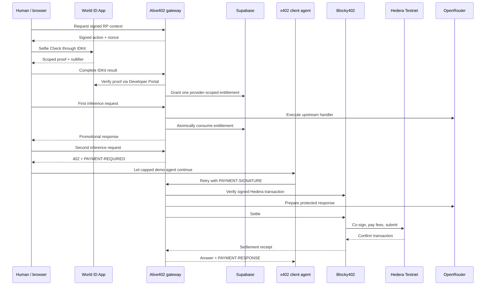

# Alive402 architecture

The World nullifier is scoped to the relying party and action. Alive402 uses one stable action per provider campaign, so changing browser, wallet, or email does not create another entitlement for that campaign.
