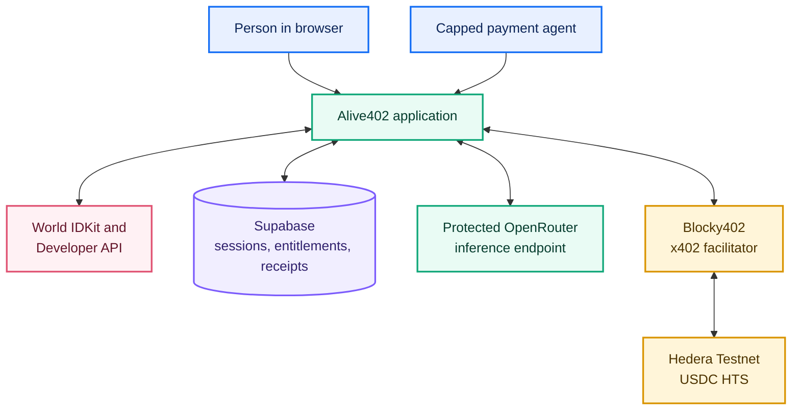
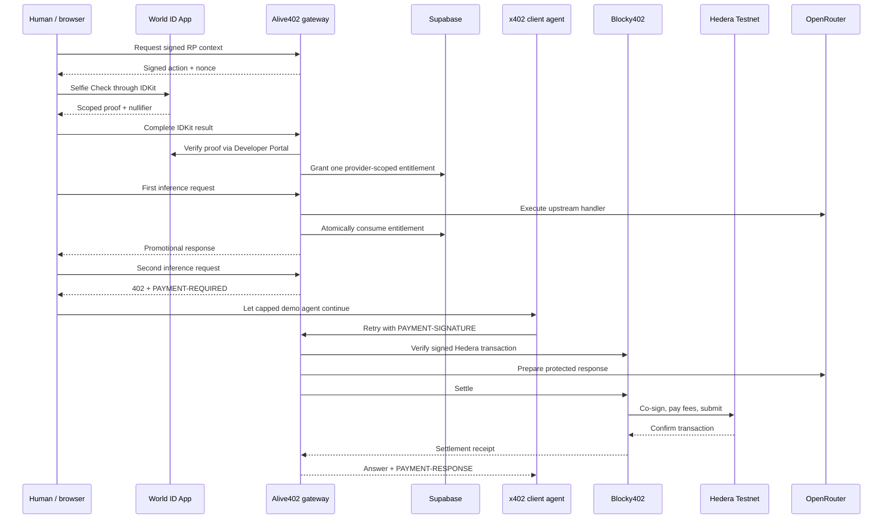

# Alive402 architecture

## Trust boundaries

- **Browser:** receives public IDKit configuration and a short-lived proof signal. It never receives World RP signing material, Supabase secret access, payer keys, or raw payment signatures.
- **Alive402 server:** creates signed World requests, verifies completed proofs, binds each proof to a one-time signal, consumes promotions atomically, and applies payment budget limits.
- **Supabase:** stores only server-side state: a scoped nullifier, hashed session token, hashed World proof signal, sanitized request evidence, and settlement reference. It stores no selfie image.
- **Blocky402 and Hedera:** determine whether a paid retry is valid and settle the configured amount to the configured merchant. Alive402 accepts only its configured testnet, asset, recipient, and maximum amount.

The World nullifier is scoped to the relying party and action. Alive402 uses one stable action per provider campaign, so changing browser, wallet, or email does not create another entitlement for that campaign. Selfie Check remains a medium-assurance anti-abuse signal, not a claim of global uniqueness.
